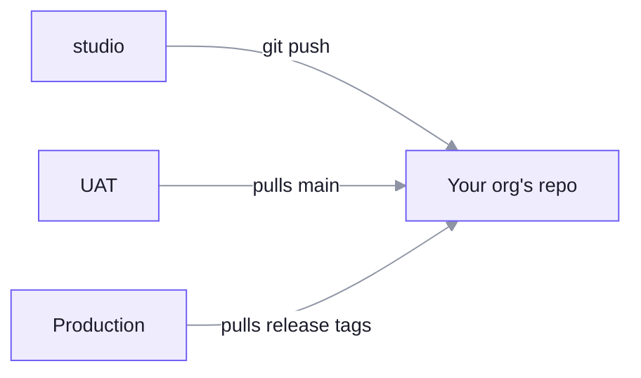

Your work reaches every universe the same way: **you push to Git, and the universe pulls.**
Nothing is pushed into a universe from outside. Reviews, approvals and protected branches all
stay in your Git, where you already run them.

| | Hosted (most businesses) | Enterprise or bank |
| --- | --- | --- |
| Universes | **One**, at `your-business.unoverse.ai` | **Dev, UAT and production**, in your own Kubernetes or hosted by us |
| The universe follows | `main` | Dev: your dev branch. UAT: `main`. Production: release tags only |
| What keeps changes safe | Git review, plus version history | Your Git approvals, plus version history |

Version history covers workflows today: every save is kept, and the **History** panel on the
**canvas** restores any version. Your **studio** work's history is your Git history.

## One org, one repo

Each org is its own Git repo, and the repo IS the org: its folders sit at the root.

```text
acme/
  unoverse.yaml     org: acme   (the org's name, declared)
  styles/  identity/  components/  apps/  skills/  blocks/  nodes/ ...
```

Make one in an empty folder. It asks for the org's name and gives you the baseline: your
tokens, your identity, Git and a pull-request check.

```bash
unoverse create
```

For examples to read and
copy, clone the demo org, [Acme](https://github.com/unoverse-orgs/acme).

A universe can hold several orgs, each pulled from its own repo. Two orgs may each have an app
called `chat`. A node type is one per platform, so give a node you copy your own type.

## Connecting a universe to your repo

An admin connects the org once, on its **Source** tab in the universe. They set the repo, the
branch or tags to follow, and a read-only key. Then they add the webhook it shows to your Git host. A push then reaches the universe
in seconds. Without the webhook, the universe checks every five minutes, and **Sync now** pulls
at once. Before applying anything it runs the same checks your pull request
ran, and if anything fails it applies nothing and keeps serving the last good version.



To roll back, revert in Git, or point production at the previous tag.

<Note>
The Git sync is built but not yet released. Until your universe runs a release that has it,
`unoverse deploy studio` sends your work to the universe directly.
</Note>

**Workflows are not in Git yet.** Moving one from UAT to production today means rebuilding it
on the production **canvas**. Publishing a workflow to your repo is planned.

## What never moves

Data stays in the universe it was made in, whichever way you run.

- **Content and your Spatial map.** Each universe ingests its own. UAT and dev take a safe
  test set; production takes the real content. Real data never leaves production, and a map is
  never copied: the same content ingested twice gives a different map.
- **Conversations, memory and traces.**
- **Credentials.** Secrets are entered in each environment. A secret that has been in a test
  environment is a test secret.

## Day-two operations

Once a universe is running, the routine work is small and each piece has a runbook.

| | |
| --- | --- |
| Platform upgrades | Pull new image tags and restart |
| Database migrations | Run against a live universe, forward only |
| Rolling back | Images roll back. Migrations do not, by design |
| Node inventory | Reconcile the database against what is installed |
| Backups | Provider-native, plus the **Spatial ML** models and the credential encryption key |
| Publish keys | Issued on the box, for CI and for first connection |
| Resizing | Change the size variable, apply, redeploy |

Your work is not in that list. It reaches a universe from your repo and needs no platform
deployment.

## Next steps

<Card title="Runbooks" icon="book-open" href="/runbooks/overview" horizontal>
Upgrade, migrate, back up and roll back a running universe.
</Card>

<Card title="studio" icon="palette" href="/onboarding/studio" horizontal>
Make an org repo and build what your universe pulls.
</Card>
