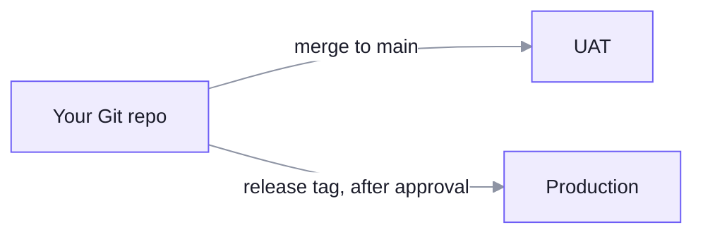

How many environments you have depends on how you run unoverse.

| | Hosted (most businesses) | Enterprise or bank |
| --- | --- | --- |
| Universes | **One**, at `your-business.unoverse.ai` | **Dev, UAT and production**, in your own Kubernetes or hosted by us |
| Where you work | In that one universe | Build in dev and UAT, promote to production |
| What keeps changes safe | Version history and rollback | Your pipeline's review and approval, plus version history |
| Git | Optional | The source of everything you build |

Version history covers workflows today: every save is kept, and the **History** panel on the
**canvas** restores any version. History for **studio** work and for your Spatial map is
coming.

## One universe

Build in **studio**, then send your work to your universe:

```bash
unoverse deploy studio
```

It goes live as it lands, with no restart. Build workflows on the **canvas**, ingest your
content and train your map, all in the same universe.

## Dev, UAT and production

Each environment is its own universe: its own database, keys and address, from the same
release. Your work reaches them from your Git repo, through your own pipeline.



Three things move, each its own way:

- **Platform version.** An image tag. UAT runs a tag first and production follows it, which
  needs pinned tags rather than a floating latest.
- **Your work.** Components, apps, skills, nodes and every other **studio** kind are files in
  your repo. Your pipeline runs `unoverse deploy studio --env uat` on a merge to main, and
  `--env production` on a release tag. Production only ever receives a tagged commit.
- **Infrastructure.** Nothing moves. Each environment is its own apply of the same Terraform,
  with its own variables and identity provider client.

Name your environments once, in `unoverse.yaml` at the root of your repo:

```yaml
environments:
  uat: https://uat.your-business.example
  production: https://ai.your-business.example
```

A deploy removes anything that is no longer in the repo, so point production only at release
tags, never at a branch.

**Workflows are not on this route yet.** Moving one from UAT to production today means
rebuilding it on the production **canvas**. Publishing a workflow to your repo is planned.

## What never moves

Data stays in the universe it was made in, whichever way you run.

- **Content and your Spatial map.** Each universe ingests its own. UAT and dev take a safe
  test set; production takes the real content. Real data never leaves production, and a map is
  never copied: the same content ingested twice gives a different map.
- **Conversations, memory and traces.**
- **Credentials.** Secrets are entered in each environment. A secret that has been in a test
  environment is a test secret.

## Day-two operations

Once a universe is running, the routine work is small and each piece has a runbook.

| | |
| --- | --- |
| Platform upgrades | Pull new image tags and restart |
| Database migrations | Run against a live universe, forward only |
| Rolling back | Images roll back. Migrations do not, by design |
| Node inventory | Reconcile the database against what is installed |
| Backups | Provider-native, plus the **Spatial ML** models and the credential encryption key |
| Publish keys | Issued on the box, for CI and for first connection |
| Resizing | Change the size variable, apply, redeploy |

Your work is not in that list. It reaches a universe by `unoverse deploy studio` and needs no
platform deployment.

---

**Next**: [Runbooks](/runbooks/overview)
