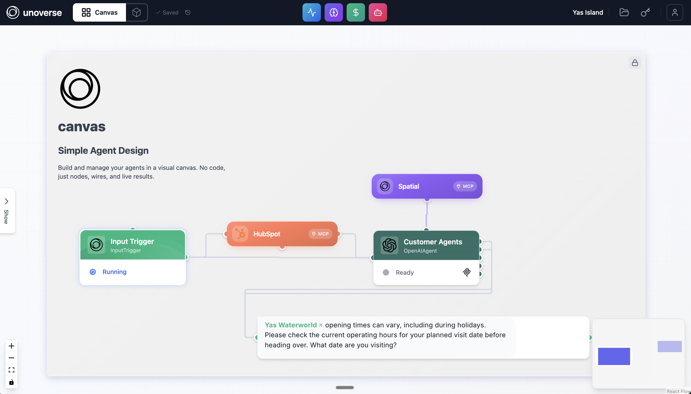
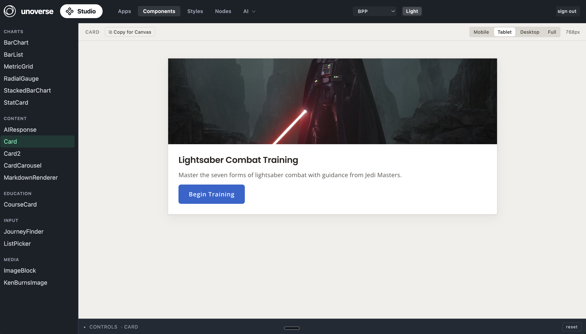
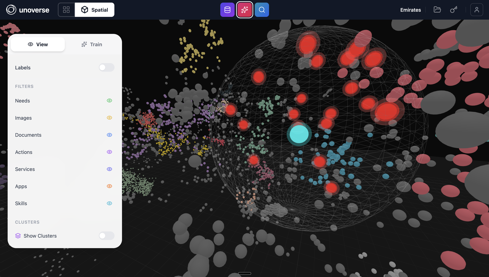

unoverse is a platform for building AI Agents that represent your brand. Your content, your Agents and the infrastructure they run on live in one governed platform.

Your customers increasingly meet your brand through AI. An Agent built on unoverse makes that meeting a real brand experience. It answers from your own content. It speaks through interfaces you design. It works on every channel you connect, from your website and mobile apps to new AI channels like ChatGPT.

**studio** is what your Agents need. **canvas** is what your Agents do. **spatial** is where your Agents live.

The platform is enterprise-grade from the ground up. It runs on your own infrastructure, with authentication, role-based access and a full audit trail. Everything you build is yours: your Agents, your interfaces and your content live in your own codebase.

[Get started](/onboarding/studio). Studio opens in a couple of minutes and needs nothing but Node.

---

## Canvas

**canvas** is where teams design, test and run Agents as visible workflows. An Agent is a workflow: a trigger receives the message, nodes reason and act, and results stream back live. You connect knowledge, models and tools, and you inspect every step.

You build a workflow visually and test it as you go. Each node runs on its own, so you can inspect its output before you connect the next one. What you test in **canvas** is exactly what runs in production. Once an Agent is live, **canvas** shows you what it's doing: the steps it takes, the tokens it uses, and what it remembers. And **canvas** is where you manage credentials, deployments, and every running Agent in one place.

[Build your first Agent](/onboarding/create-your-first-agent)

## Studio

**studio** is where you create everything an Agent needs: integrations, interface components, design systems, skills and prompts. You manage them once, and every team and every Agent uses the same set. Change one, and every experience built on it changes with it.

Interfaces are definitions, not code. This approach is called server-driven UI, or SDUI: the platform serves each interface as data, and every client renders it natively. You write a component once and style it with your brand's design tokens. SDKs for web, native iOS, Android, React Native, and Flutter render the same definition as native UI on each platform. **studio** previews everything as you edit, state by state, across screen sizes. Publishing a change requires no app release.

[Create a component](/onboarding/create-a-component)

## Spatial

**spatial** is a context management system: a new world where every Agent finds exactly what it needs, exactly when it needs it.

Everything an Agent draws on lives here: content, images, skills, tools, and apps, arranged by meaning. An Agent pulls just what the moment requires. Context stays small. Answers stay fast. Every conversation costs less. And you decide what's in the world, so you decide what your Agents can say and do.

[Ingest your content](/onboarding/ingest-content-to-spatial)

---

## How it works

The customer states what they want, and the brand assembles the answer. A client sends the message over MCP or WebSocket. The engine runs your workflow: nodes call models, query **spatial**, and execute your logic, streaming progress as they go. Components render the results in your interface, on whatever platform the conversation is happening.

[How it fits together](/onboarding/how-it-fits-together) is the quick map, and the [Architecture](/architecture/overview) section carries the full detail: deployment, networking, data and the security posture.

---

## Documentation

| Section | Contents |
|---|---|
| [Onboarding](/onboarding/studio) | Set up, then nine challenges in order |
| [Design](/design/overview) | Components, apps, tokens, and the state model |
| [Nodes](/nodes/overview) | Custom node development: types, patterns, credentials, testing |
| [Runbooks](/runbooks/overview) | Operations: deployment, database, TLS, hardening |
| [Architecture](/architecture/overview) | Deployment options, provisioning, networking, data, security |
