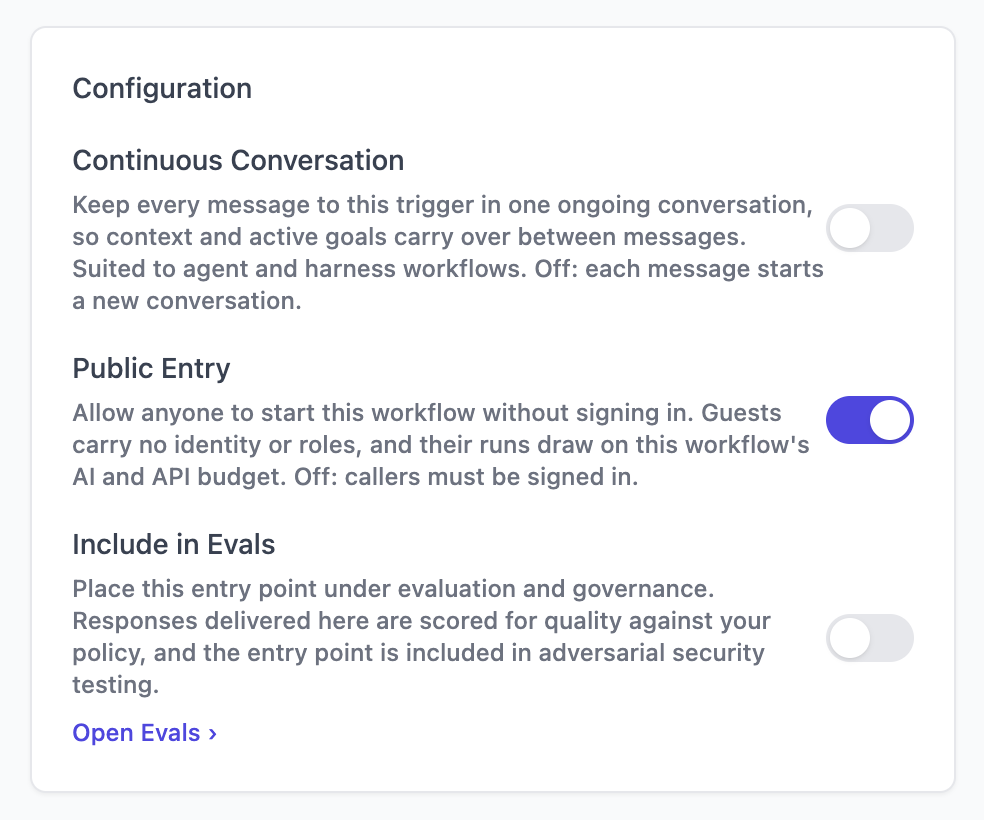

Your universe serves an embeddable client at `/embed.js`. One script tag puts your Agent on
any website: it draws a launcher, and clicking it opens a drawer with your app inside.

```html
<script async src="https://api.your-domain.com/embed.js"
        data-app="your-org/your-app"></script>
```

Nothing else is configured on the page. The script works out where your universe is from its
own `src`, takes the app from `data-app`, and asks your universe for everything else at
runtime.

## Before you begin

Your universe is running, and you have an app published from **studio** and bound to a
workflow. Its id is `org/name`.

## Build it

<Steps>
<Step title="Start the client starter">

The starter is a small fake website with the tag already in place. It is on GitHub at
[unoverse-platform/client](https://github.com/unoverse-platform/client), and the CLI
scaffolds it for you.

```ansi Terminal
$ mkdir my-site && cd my-site
$ unoverse create

  ⬡ What are you building?

    1  Studio     Components, agents and workflows
                  Most people start here
    2  Universe   Run the platform yourself, on your own infrastructure
  ❯ 3  Client     A client accelerator that talks to unoverse

  ✓ client scaffolded in this folder
```

Choose **Client**. `create` scaffolds into the folder you are standing in, so make one
first. Passing a name makes a subfolder instead: `unoverse create my-site`.

Then it hands you three commands:

```bash
npm install
cp .env.example .env
npm run dev                     # http://localhost:3010
```

`.env` needs two values, and the rest only matter if your app has a login:

| | |
|---|---|
| `VITE_UNOVERSE_URL` | Your universe's address |
| `VITE_UNOVERSE_APP` | Which app to load, always `org/app` |

The page it serves stands in for the website you already have, so you see the assistant in
place rather than on a blank page.

</Step>
<Step title="Point it at your app">

`VITE_UNOVERSE_APP` is the id from **studio**, in the form `org/app`.

Open the page and click the launcher. Your app opens in the drawer.

</Step>
<Step title="Choose who can use it">

The audience is decided on the **canvas**, not on the page. Open your workflow's
<span className="node-chip">Input Trigger</span> and turn on **Public Entry**.



| Public Entry | What a visitor gets |
|---|---|
| On | Anyone can start the workflow without signing in. A guest identity is minted once and kept in their browser. |
| Off | Callers must be signed in, and your page supplies the token. |

Two things follow from turning it on. Guests carry no identity and no roles, so anything your
workflow gates on a role is closed to them. And their runs draw on this workflow's AI and API
budget, so a public entry point is a spending decision as much as an access one.

Each trigger decides its own audience, so a public trigger on the same workflow opens nothing
for a signed-in one.

</Step>
<Step title="Hand it your login">

Skip this step if your app is public.

The embed never signs anyone in. Your website already has a login, and the embed forwards its
token. Publish a getter **before** the embed tag:

```html
<script>
  window.unoverseConfig = { token: () => myApp.getAccessToken() }
</script>
<script async src="https://api.your-domain.com/embed.js"
        data-app="your-org/your-app"
        data-login-url="/login?return={url}"></script>
```

The tag is `async`, so a script after it may run second. Declaring the getter first is what
makes it reliable.

| | |
|---|---|
| Called | Before every request, so a refreshed token is picked up on its own |
| May return | A string, `null`, or a promise of either |
| `null` means | Anonymous. A public app runs; a secured one asks the visitor to sign in |

`data-login-url` names your sign-in page. `{url}` becomes the page the visitor was on,
encoded, so your login can return them to it. Without it the drawer says "Please sign in to
continue" and stops there.

`src/host.js` in the starter is a working OIDC example. Replace the body of `token()` with
however your site gets its token, or delete the file if your app is public.

Your universe verifies tokens against the issuer and audience it was deployed with, so they
have to match the ones your site signs in with.

</Step>
<Step title="Put it on your own site">

Delete the starter's page and keep two tags:

```html
<script type="module" src="/src/host.js"></script>
<script async src="https://api.your-domain.com/embed.js" data-app="your-org/your-app"></script>
```

The second tag is the assistant. The first is your login, and it goes if your app is public.

</Step>
</Steps>

## What happens, and when

**On page load** the script is downloaded, reads its own tag, and draws a launcher. No request
reaches your universe. A visitor who never clicks costs you nothing.

**On the first click** it asks your universe whether the app needs a login, takes a token from
your page or mints a guest identity, reads the app over MCP, and puts it in an iframe. After
that it only relays: the app says how wide it wants to be, and the drawer obeys.

If that first question cannot be answered, the embed assumes the app is secured and asks for
a sign-in. It fails closed, never open.

## Reference

### Script tag attributes

Only `data-app` is required.

| Attribute | Default | What it does |
|---|---|---|
| `data-app` | required | Which app to load, always `org/app` |
| `data-icon` | a neutral chat glyph | A URL for the launcher icon, served from your own domain |
| `data-label` | "Open the assistant" | The launcher's accessible name and tooltip |
| `data-color` | `#111827` | The launcher's background, any CSS colour |
| `data-panel` | `#fff` | The drawer's background while the app loads. Match your app's theme so the open never flashes white. |
| `data-side` | `right` | Which edge the drawer opens from: `left` or `right` |
| `data-chrome` | drawn | `none` draws no launcher, and your page calls `unoverse.open()` |
| `data-login-url` | none | Your sign-in page, offered when the app needs a login |

The drawer's width is not an attribute. The app decides how wide it is, so the same app is
the right size on every site that embeds it.

### Your own buttons

`window.unoverse` exists once the script has run.

| Call | What it does |
|---|---|
| `unoverse.open()` | Opens the drawer, and mounts the app on the first call |
| `unoverse.close()` | Closes the drawer and ends the stream |
| `unoverse.newConversation()` | Closes the drawer and starts a fresh thread next time |

With `data-chrome="none"` these are the only way in. Your site keeps its own buttons, and the
assistant opens from any of them.

### Analytics

The embed reports events to the analytics tag your page already has, and it runs in your
page's own realm. The visitor's client id, their consent state and your retention terms are
the ones your site already resolved, so the events file under the same visitor as the rest of
your site. A server-side call would inherit none of that.

| Target | What it calls |
|---|---|
| `dataLayer` | Pushes onto your existing `window.dataLayer` |
| `gtag` | Calls `window.gtag` |
| `custom` | Calls a global you name |

You choose which moments are reported by adding a key to a node, so nothing is measured
unless you say so. [Analytics](/design/analytics) covers what to mark and what arrives.

### What the embed stores

One value in `localStorage`, and it is not a cookie.

| Key | Lifetime | Purpose |
|---|---|---|
| `unoverse:guestId` | indefinite | A returning anonymous visitor is recognised |

The conversation is never stored. It lives exactly as long as the page that opened it, so a
reload starts a fresh one. The Agent still recognises the visitor through the guest id and
user memory.

## Next steps

<Card title="Deployment" icon="server" href="/onboarding/deployment" horizontal>
Take your universe to a production server.
</Card>

<Card title="The Design journey" icon="palette" href="/design/quick-start" horizontal>
Components, state, apps and tokens, in full depth.
</Card>
