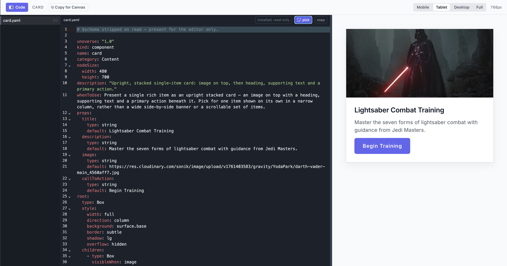
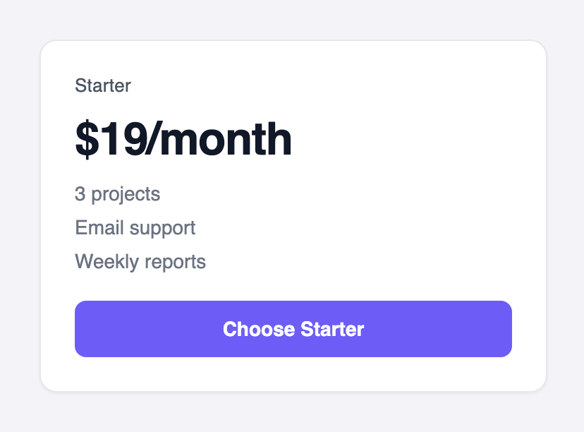
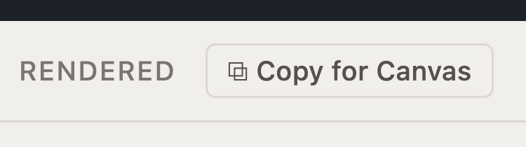

Design the interfaces your Agents speak through. You write a component once, in YAML, and
every channel renders it natively.

<div className="concept-callout">
<div className="concept-eyebrow">Server-driven UI</div>
<div className="concept-title">The interface travels as data</div>

UI is data, not code. Your universe sends the definition. An SDK on the other side draws it
with that device's own native controls.
<br /><br />
One definition serves every channel: your website, your iOS and Android apps, ChatGPT,
Claude. Publish a change and it is live on every one of them, with no rebuild or release
cycle.
<br /><br />
[How it works here](/design/sdui-and-mcp-apps) · [MCP Apps](https://modelcontextprotocol.io/extensions/apps/overview) · [SDUI](https://medium.com/digia-studio/server-driven-ui-sdui-the-necessary-evil-for-scalable-mobile-apps-80c650a2c8de)
</div>

**Why YAML.** It is the plainest thing that can carry structure. Your editor checks it against
a schema as you type. Any AI tool you already use can read and write it. There is nothing to
compile.

Definitions are composed from a
[small closed set of primitives](/design/sdui-and-mcp-apps#the-closed-primitive-set), and
every visual value is a token name the theme resolves. That is all the theory this page needs.
The [Design](/design/overview) tab is the full journey.

| | |
| --- | --- |
| **What you'll build** | A price card component your Agent can stream data into, in your own project and your own brand |
| **Where it lives** | `design/<your-project>/components/pricecard/` |
| **Where you'll see it** | Live in **studio** while you design, and in the conversation once it is wired to a workflow |

## Build it

<Steps>
<Step title="Open Studio">

Open **studio**:

```bash
unoverse studio
```

Then open **Components**. Every definition renders from its prop defaults, and the controls
walk its layouts and states.

Open the code view on any of them: the definition on one side, the live preview on the other.
Edit the definition and the preview follows as you save.



</Step>
<Step title="Create your org">

Your own work lives in your org: its components, its apps, its brand. The folder you run in
becomes its name, and that name travels with everything the org publishes.

```ansi Terminal
$ mkdir acme && cd acme
$ unoverse create

  ⬡ What are you building?

  ❯ 1  Studio     Components, agents and workflows
                  Most people start here
    2  Universe   Run the platform yourself, on your own infrastructure
    3  Client     A client accelerator that talks to unoverse

  Created design/acme/, prompts/ and nodes/ in /Users/you/acme
```

Choose **Studio**. Adding a second org later is the **New project** item in **studio**'s
project dropdown.

You get three folders, and your org sits inside `design/`:

```
acme/
  design/
    acme/              your org
      components/      one piece of interface
      apps/            whole surfaces
      styles/          colour, type, spacing
  prompts/
    skills/            behaviour an Agent follows
    blocks/            reusable prompt fragments
  nodes/               your own integrations
```

A worked example lands in each, so no folder starts empty: a welcome component, a chat app,
and a colour file showing how the token cascade works.

</Step>
<Step title="Make your theme">

The first design work in a new org is the brand. It lives in `design/acme/styles/`:

| Folder | What you set there |
| --- | --- |
| `base/` | The raw scales: color palettes, typography and fonts, spacing, radius |
| `semantic/` | The names components use, mapped onto your scales |
| `themes/` | `light` and `dark`: the values each theme resolves to |

Start with `base/color.yaml` and `base/typography.yaml`: your palette and your fonts. In **studio**, switch to your org and change a value. Every component re-renders in your brand, live, with no build step. Edit the file, and the preview follows as you save.

Change token values freely; keep every token name, and the theme contract stays green.

</Step>
<Step title="Create your own component">

Author your component in your project, at `design/acme/components/pricecard/pricecard.yaml`. The file name is the component's name, and the lint enforces it. Here is a complete simple price card, and what it renders:

<Tabs>
<Tab title="Definition">

```yaml design/acme/components/pricecard/pricecard.yaml
unoverse: "1.0"
type: component
name: pricecard
category: General
nodeSize: { width: 360, height: 320 }
description: "A pricing card: plan name, price, feature list, and a call to action."
whenToUse: >-
  Present ONE plan or offer with its price and what it includes. Pick for a single
  purchasable option, not for comparing metrics or listing content.

props:
  title: { type: string, default: Starter, input: true }
  price: { type: string, default: $19/month, input: true }
  features:
    type: array
    input: true
    default:
      - label: 3 projects
      - label: Email support
      - label: Weekly reports

root:
  type: Box
  style:
    width: full
    direction: column
    gap: "3"
    padding: "6"
    background: surface.base
    border: subtle
    radius: lg
    shadow: sm
  children:
    - type: Text
      bind: { value: title }
      style: { font: label, weight: medium, color: text.secondary }

    - type: Text
      bind: { value: price }
      style: { font: headline.lg, weight: semibold, color: text.primary }

    - type: Each
      bind: { items: features }
      style: { direction: column, gap: "2" }
      app:
        type: Text
        bind: { value: label }
        style: { font: body.sm, color: text.tertiary }

    - type: Ref
      ref: button
      with: { label: Choose Starter }
```

</Tab>
<Tab title="Rendered">



</Tab>
<Tab title="Data">

A workflow fills the card by sending an object whose keys match the `props`, by name:

```yaml Data a workflow streams in
title: Pro
price: $49/month
features:
  - label: Unlimited projects
  - label: Priority support
  - label: Daily reports
```

</Tab>
</Tabs>

Reading it top to bottom:

| Part | What it does |
| --- | --- |
| The envelope | Names the component and carries `whenToUse`, which is how Agents discover it |
| `props` | Every field a workflow can fill, each with a realistic `default`. Those defaults are what **studio** renders in mock mode, and `input: true` marks a field as workflow-fed |
| `root` | The layout, composed from the closed primitives: a `Box`, two bound `Text` elements, an `Each` over the features, and the shared button atom through `Ref` |
| `style` | Token names only. No pixels, no hex, anywhere |

</Step>
<Step title="Check it">

Lint runs when you ship, and blocks on any error, so nothing broken reaches a universe.

The linter enforces the design rules with doc-cited messages: token names only (no raw px or hex), every bound field declared in `props`, one home for every piece of state. **studio** and the platform apply the same rules, so a clean lint means it ships.

</Step>
<Step title="Put it in a workflow">

One `Component` node serves every component you write, so there is nothing to register and
nothing to restart. A new definition is renderable the moment you save it.

Your component travels from **studio** to **canvas** by copy and paste:

1. In **studio**, open **PriceCard** under **Components**.
2. Click **Copy for Canvas**. The component is copied to your clipboard as a canvas node.



3. In **canvas**, open your workflow and paste with **Cmd+V**. The node lands on the canvas, sized to the card.
4. Double-click it and fill its fields, the same `title`, `price`, and `features` you saw in the Data tab, from upstream signals or literals.

Step through the workflow and the card renders live in the conversation, in your org's theme.

</Step>
</Steps>

<Note>
Restarts are only for **new** components, because the platform synthesizes a node per definition at boot. Edits to existing components apply live.
</Note>

## How far this goes

A price card is the small end. A component can carry states and layouts of its own: a wizard
that walks through steps, a card that expands to full screen, a product finder with its own
private flow.

Apps go further. They are whole microapps, with their own layouts and states, discovered and
opened by Agents in the conversation.

State is handled for you. Each component owns its own, and the platform keeps one shared
state for the whole conversation. Views, panels and flows stay in sync, with no state library
to wire.

The [Design](/design/quick-start) section covers all of it: components, [state](/design/state),
apps and tokens.

## Have Claude Code build it

<div className="skill-callout">

<div className="skill-eyebrow">Installed by unoverse update</div>
<div className="skill-title">unoverse-create</div>

The same skill that builds nodes designs components. Open your project and describe what you want:

> Create a pricing card component with a title, three feature lines, and a call to action.

It follows the rules this page just walked through: the closed primitives, token names only, a realistic default on every prop. What it writes passes the same lint your own work does.
<br /><br />
[How the skills work](/onboarding/skills).

</div>

## Next steps

<Card title="The Design journey" icon="palette" href="/design/quick-start" horizontal>
Components, state, apps, and tokens, in full depth.
</Card>

<Card title="Create a client app" icon="globe" href="/onboarding/create-a-client-app" horizontal>
Put your Agent on your own website.
</Card>
