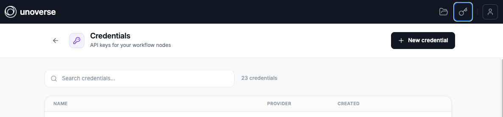
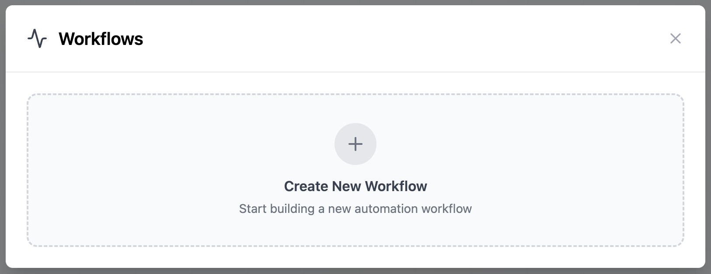
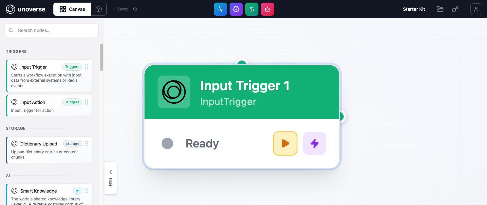
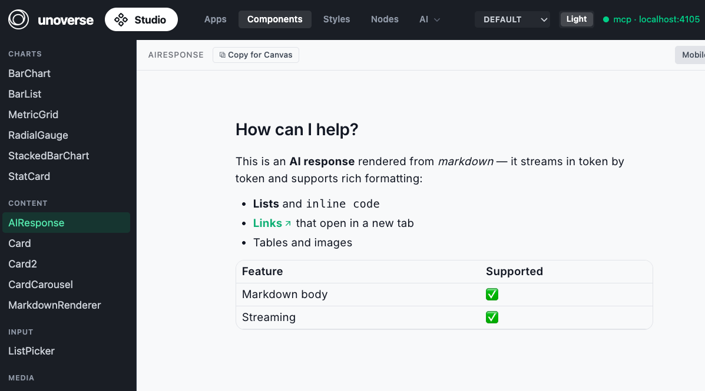
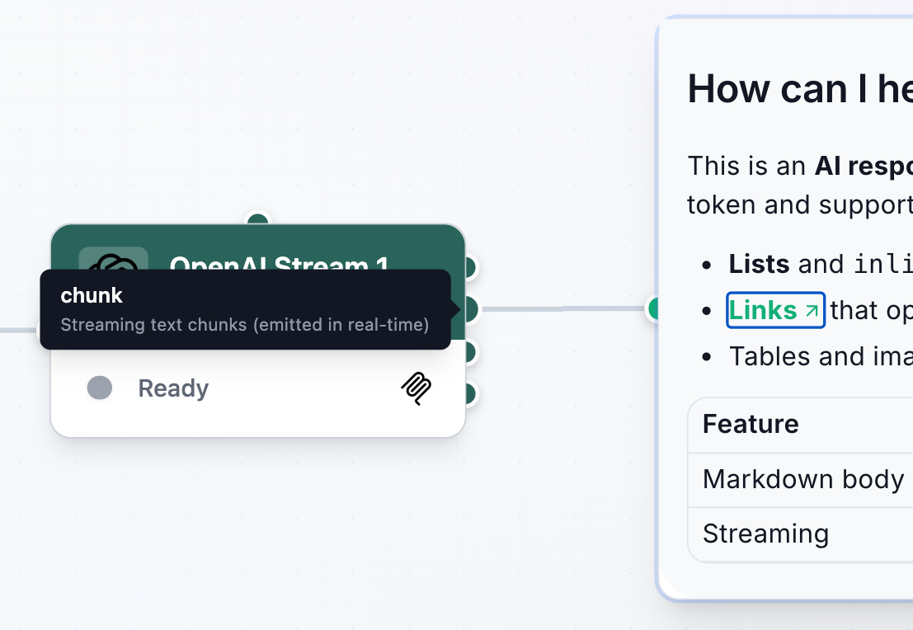
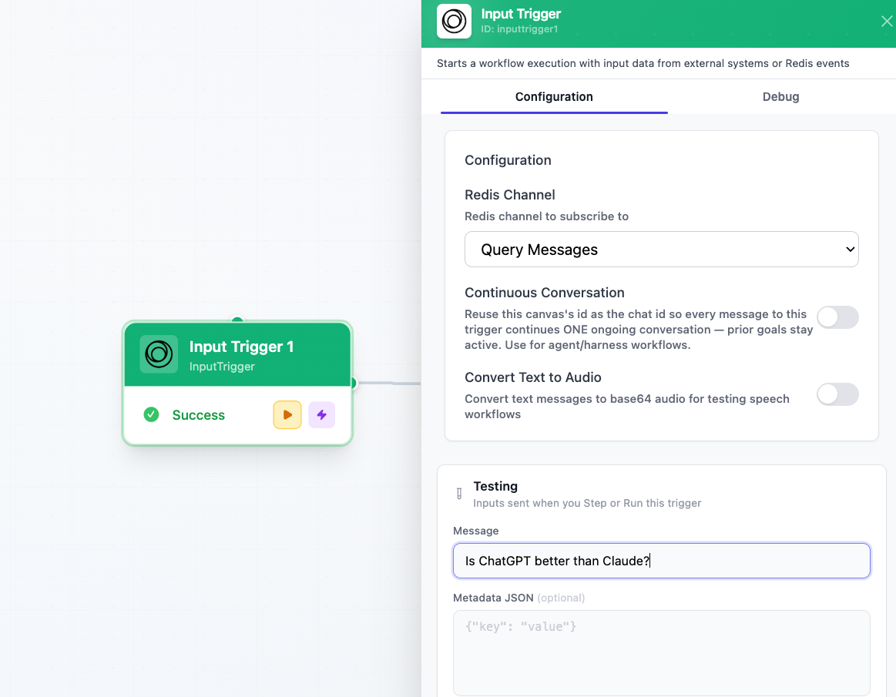
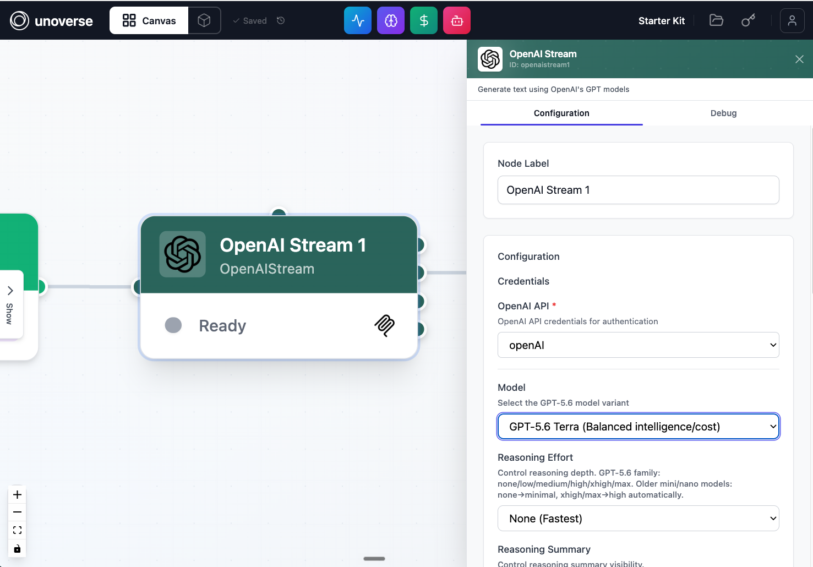
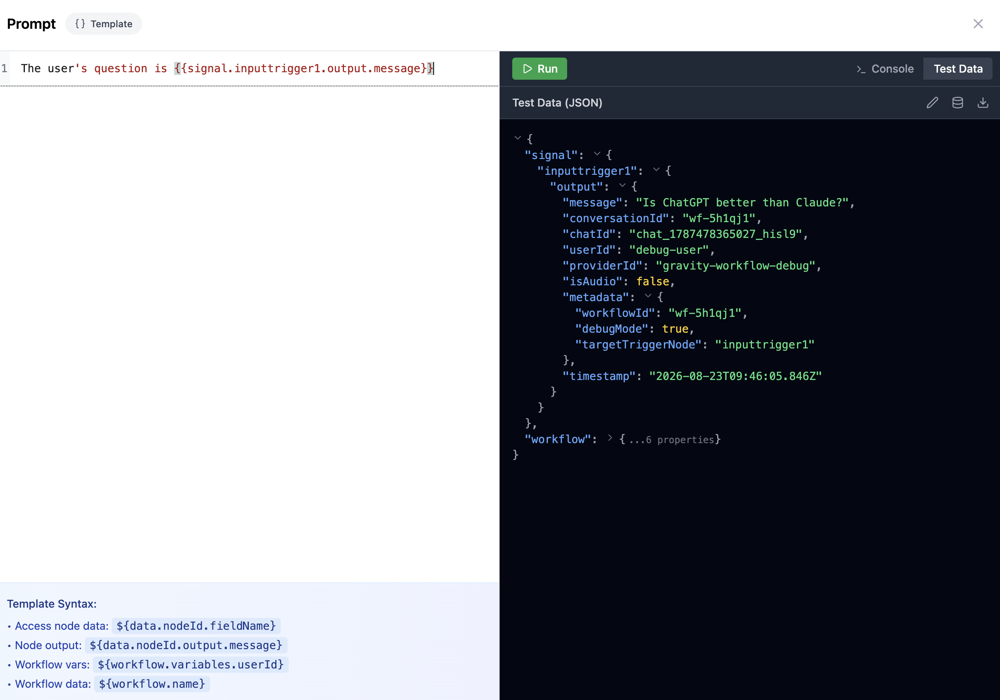
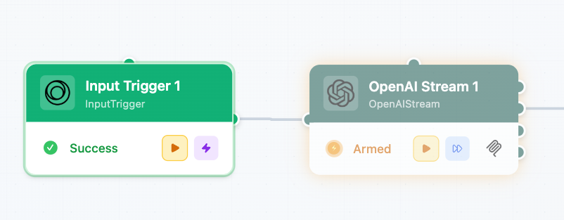
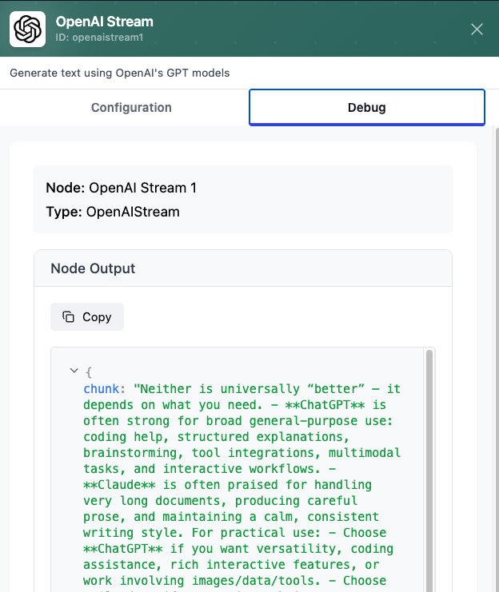

Build a chat Agent in **canvas**: a trigger that receives the message, a model that thinks, and a response that streams back. Ten minutes, no code.

## Before you begin

Your universe is running and open in a browser. Locally that is `unoverse start`, and
**canvas** is at http://localhost:3001.

You have an OpenAI API key, and the OpenAI package is installed from the
[marketplace](/onboarding/marketplace-nodes).

## Build it

<Steps>
<Step title="Add your OpenAI credential">

In **canvas**, open **Credentials** and click **New credential**. Select the **OpenAI API** type, name it, paste your API key, and save. Nodes never read keys from config or env files; they request credentials at execution time, decrypted and injected by the platform.

</Step>
<Step title="Create a workflow">

Open **Workflows** and click **Create New Workflow**, then name it. An empty **canvas**
opens, ready for nodes. This comes first: nodes live in a workflow, so there is nowhere to
drop one until you have made it.

</Step>
<Step title="Add three nodes">

The workflow needs three nodes:

1. Input Trigger receives the user's message.
2. OpenAI Stream sends it to the model and streams the reply.
3. Streaming Text displays the reply to the user.

Drag Input Trigger and OpenAI Stream from the node library onto the **canvas**.

Streaming Text is a component rather than a node, so it comes from **studio** in your universe. Open **studio**, then **Components**, select **StreamingText** and click **Copy for Canvas**. Paste it onto your canvas.

Now connect them left to right: Input Trigger → OpenAI Stream → Streaming Text.

The dots on a node's edges are **connectors**. Each output connector carries one named signal. Hover over a connector to see its name and what it carries. The names matter: they are how downstream fields reference the data, as in `signal.openaistream1.stream`.

OpenAI Stream has more than one output, so pick the right one: connect from its `stream` connector. `stream` carries the live text, so the reply flows into Streaming Text as the model writes it.

<Note>
Every node instance gets an id: its type in lowercase with the spaces removed, then a number. **Input Trigger** becomes `inputtrigger1`, and **OpenAI Stream** becomes `openaistream1`. Drop a second one and it takes the next number.

Downstream nodes read upstream outputs through these ids: `signal.<nodeId>.<output>`.
</Note>

</Step>
<Step title="Set a test message">

Double-click Input Trigger to open its settings. Under **Testing**, enter a **Message**. This is the question that kicks off the flow when you run the trigger.

</Step>
<Step title="Configure the model">

Double-click OpenAI Stream to open its settings:

- **OpenAI API**: select the credential you created in step 1.
- **Model**: pick a GPT-5.6 variant.
- **System Prompt**: `You are a helpful assistant. Please answer the user's question.`
- **User Prompt**: `The user's question is {{signal.inputtrigger1.output.message}}`

The double braces are a Handlebars reference: at run time it resolves to the message the trigger received.

Open the prompt editor on that field to see what you can reference. **Test Data** shows the
real shape of the signal, so you can read the field names off it instead of guessing, and
**Run** resolves your template against that data before you run the workflow.

</Step>
<Step title="Configure the response">

Double-click Streaming Text:

- **Main response text**: `return signal.openaistream1.stream`

This field takes JavaScript. `stream` is the model's streaming output, so text appears live as the model writes. The complete reply is also available as `signal.openaistream1.text` once the node finishes.

<Note>
Config fields accept two syntaxes: Handlebars (`{{signal...}}`) for templating text, and JavaScript (`return signal...`) for computing a value. Use either; don't mix them in one field.
</Note>

</Step>
<Step title="Step through it">

Your workflow saves automatically as you build; there is no save button. Just run it: press the play button on Input Trigger to execute it with your test message. When a node completes, the next node in the chain becomes **armed** and flashes, meaning it is ready to run. Press its play button to step forward, inspecting each node's output as you go.

The moment a node runs, its output is ready to inspect. Double-click the node and open the **Debug** tab. It shows every signal the node produced and the exact value each one carried on this run.

Step through all three nodes and watch the reply stream into Streaming Text.

</Step>
</Steps>

## Next steps

<Card title="Create your first node" icon="box" href="/onboarding/create-your-first-node" horizontal>
Extend the platform with your own logic.
</Card>

<Card title="Ingest content to Spatial" icon="globe" href="/onboarding/ingest-content-to-spatial" horizontal>
Ground your Agent's answers in your own content.
</Card>
