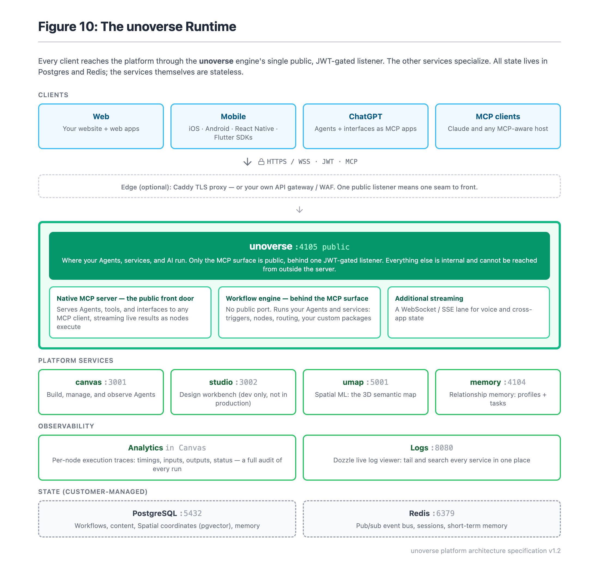
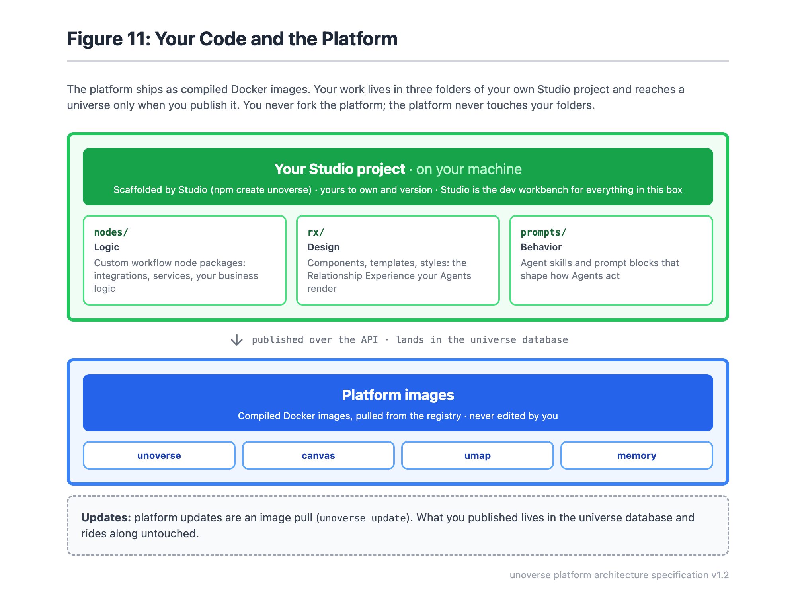

A quick map before you start building. The **Architecture** section has the full detail.

## Two ways to use unoverse

The platform is the same either way, and so is authoring. You build in **studio** and
publish over the API. What changes is who runs the universe.

| | **Connect to a universe** | **Run your own** |
| --- | --- | --- |
| Who runs it | someone else | you |
| Where it runs | their account | AWS, DigitalOcean, Azure, GCP, on-premises |
| What you install | **studio** | **studio**, and the platform |
| What you need | an address and an account | a registry token, and somewhere to run it |
| Right when | the universe already exists | the deployment has to be yours |

**Connecting is the faster start.** You point **studio** at a universe that is already
deployed. That might be a hosted unoverse you have an account on, or your own company's
deployment you have permissions for. Your components, templates, skills and nodes publish
into that universe's database, and authoring never requires a deployment of your own.

**Running your own puts the same platform in your account.** It suits a full enterprise
deployment in a private cloud. It is the only option when data cannot leave your network.
You pull the platform images from the registry, and Docker Compose runs them.

<Note>
**The registry token comes with your licence.** It is read-only, and it lets your
machines pull the platform images. Terraform takes it as `docr_token`, and `unoverse deploy`
asks for it on the first run of a new ground.
</Note>

## Where you can run it

One VM with Docker Compose is the deployment, at every size. An operations team can read the
whole arrangement in an afternoon.

<CardGroup cols={2}>

<Card title="Amazon Web Services" href="/architecture/aws">

**Ready now.** Terraform creates the machine, the database, the cache, the entry point, and Cognito for sign-in
</Card>

<Card title="DigitalOcean" href="/architecture/digitalocean">

**Ready now.** The same, and Postgres has three modes: a new cluster, one you already own, or any URL
</Card>

<Card title="Azure" href="/architecture/azure">

**Coming soon.** The images run there today on a VM you make yourself. There is no Terraform module yet
</Card>

<Card title="Google Cloud">

**Coming soon.** The same position as Azure. The images run on a VM you make yourself
</Card>

</CardGroup>

**On-premises works today.** The same images run on hardware you already own. You bring the
entry point, and [Deployment Options](/architecture/deployment-options) states the
requirement.

Nothing about the platform requires a cloud. The cloud modules provide three things: a TLS
terminator, a Postgres and a Redis. An enterprise that already runs all three needs none of
them.

**Two more ways to run it are coming.** They are different things, and each suits a
different operations team.

| | |
| --- | --- |
| **A KVM image** | A prebuilt virtual machine disk you boot on your own hypervisor, such as Proxmox, oVirt or OpenStack. Nothing to install, and no Docker knowledge needed |
| **Kubernetes** | A Helm chart, for a team that already runs a cluster and wants the platform scheduled alongside everything else |

Today the platform runs as Docker containers on one machine, and both of the above wait on
the multiple-instance work. [Deployment Options](/architecture/deployment-options) states
what is ready and what is not.

## Authentication

**Authentication is a deployment input, and the platform will not run in production without
it.** The universe verifies a JWT on every request, so identity is settled before a workflow
sees anything. Roles and permissions are separate levels, and
[Security](/architecture/security#authorization) covers how the two map.

You bring the provider, with one exception.

| Ground | Identity |
| --- | --- |
| AWS | Terraform creates a Cognito user pool, one group per role, and the first administrator |
| DigitalOcean | You bring an OIDC issuer. Auth0 is the common choice, and any compliant provider works |
| Your own VM | The same. Set `AUTH_ISSUER` and `AUTH_AUDIENCE`, and the platform verifies against your provider's JWKS |

AWS is the one ground that creates a provider for you. Everywhere else the issuer is a
variable, so swapping Auth0 for Entra is configuration rather than a code change.

<Note>
**Auth can be turned off for local testing, and only for local testing.** `AUTH_ENABLED=false`
injects a fixed development identity with no roles and no permissions. The service refuses
to start if that flag is set while `NODE_ENV=production`, so a test setting cannot reach a
deployment by accident.
</Note>

## The runtime

At its core, unoverse is an MCP server. Every interface you build is served to clients as an
MCP app, and every MCP app is powered by a workflow and the nodes behind it. The
implementation is native MCP rather than an adapter.

So there are two ways to reach a universe. **An MCP client connects natively**, with nothing
to build, and ChatGPT, Claude and Claude Code all work today. **Everything else uses an
SDK**, which renders the same definitions as native UI. The web SDK ships now, and React
Native, Flutter, iOS and Android follow as those SDKs land.

- **unoverse** is the engine. Your Agents run here, your workflows execute here, and the MCP
  surface is served from here. It is the only service the internet reaches, and every
  request on it is authenticated.
- **canvas** is where you build and observe Agents. It is an operator tool, not a public
  page.
- **Spatial ML** maintains the semantic map behind **spatial**.
- **Memory** keeps user profiles and open tasks, so an Agent can reason about the same
  person across weeks.

All state lives in Postgres and Redis.

<Note>
**The MCP surface signs clients in the way the spec now defines.** A call with no token gets
a 401 and a `WWW-Authenticate` header naming the universe's protected resource metadata
(RFC 9728). The client reads that, finds the authorization server, and runs an OAuth flow
with PKCE. Nothing about your provider is configured in the client, because the client
discovers all of it from the universe.
</Note>

[What runs](/architecture/overview#what-runs) covers each service in detail,
[Ports and trust zones](/architecture/overview#ports-and-trust-zones) covers what can
reach them, and [Data](/architecture/data) covers what each store holds.

## Your code and the platform stay separate

The platform runs on the VM as Docker images, pulled from the registry by tag. Everything
you author lives in your universe's database and arrives by publishing.

You author in **[Studio](/onboarding/studio)**: components, templates, skills and nodes. It is
not one of the platform services. It is a developer tool you install from npm, it runs on
your own machine against your own files, and it sends your work to a universe over the API
when you publish. Nothing of **studio** is deployed with the platform.

The separation makes the first mode work. A universe someone else runs is still one you can
author against, because publishing is an API call rather than a deploy.

You never fork the platform, and the platform never writes to your folders. Upgrading is an
image pull, and it cannot disturb your content. The full story is in
[Your code and the platform stay separate](/architecture/overview#your-code-and-the-platform-stay-separate).

## The same system at every size

There are three sizes, and they scale the machine and the data stores rather than the shape
of the system. A demo universe and a production one run the same images in the same
arrangement. [Deployment Options](/architecture/deployment-options) compares the sizes.

Infrastructure is Terraform that ships with the starter kit. It runs in your own cloud
account and hands the deploy a complete environment file.
[Provisioning](/architecture/terraform) walks through the five inputs.

## Read on

| | |
| --- | --- |
| [Architecture](/architecture/overview) | What runs, and what it talks to |
| [Deployment Options](/architecture/deployment-options) | The three sizes, and what is deliberately not offered |
| [Provisioning](/architecture/terraform) | Five inputs, one command |
| [Security Posture](/architecture/security) | Written for the review |
| [Runbooks](/runbooks/overview) | Deploying and operating a universe |
