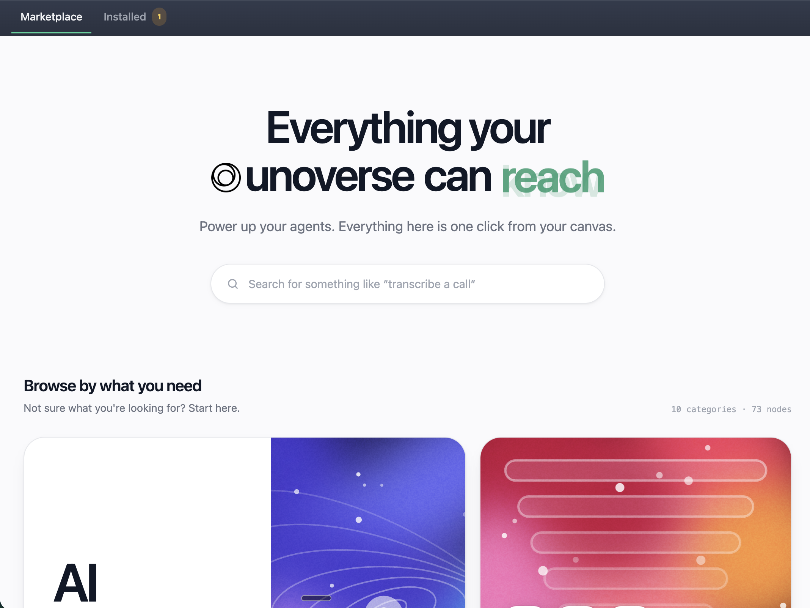

{/* The address below is the live catalogue and both Terraform stacks default to it.
    When it moves behind a domain, change it here, in .env.example, in lib/setup.sh and
    in the two variables.tf. Better still, give UNOVERSE_MARKETPLACE_URL a default in
    code (MARKETPLACE.md §5 decided it should have one) and delete this step outright. */}

Your universe starts empty. The marketplace stocks it. Nodes for OpenAI, Airtable, Slack and
AWS, the design system your components render from, and skills your Agents can use. Each one
installs into your own database, one at a time. Start here and take what you need.

## Before you begin

The platform is running (`unoverse start`), and **Studio** is open (`unoverse studio`).

<Steps>
<Step title="Point your universe at a marketplace">

A universe installs from whichever catalogue its `.env` names, and `unoverse setup` leaves
that setting empty. Point it at the marketplace:

```bash .env
UNOVERSE_MARKETPLACE_URL=https://unoverse-marketplace-4hlb9.ondigitalocean.app
```

Restart with `unoverse restart`. Give it the site root and the universe finds the catalogue
at `/marketplace/` on its own. Left empty, the **Marketplace** shows only the definitions
already on this machine's disk, which is what an offline or air-gapped install wants.

A deployment sets the same value from Terraform, where it is already the default, so this
step is for local development.

</Step>
<Step title="Open the Marketplace">

In **Studio**, click **Marketplace** in the header. It opens on the catalogue, with
**Installed** beside it showing what this universe already holds.



Browse by category, or search. Search is semantic rather than substring, so describe the job:
"transcribe a call" finds the nodes that do it, whatever they are named.

</Step>
<Step title="Add a package">

Open a category. It lists every package in it, expanded to show the nodes each one holds.
Three counts sit above the list: packages, nodes, and how many you have already added.


A package is a set of nodes that belong together, such as everything that talks to OpenAI.
Click **Add** on one and it writes a row per node into your universe.


The nodes register straight away and appear in the node library in **Canvas**, ready to drag
onto a workflow. Nothing restarts, and the button reads **Added** once they are yours.

Add **OpenAI** now. The next challenge uses <span className="node-chip">OpenAI Stream</span>
to build your first Agent.

</Step>
<Step title="Install the design system">

The design system is chosen rather than assumed. A new universe has no components, atoms or
styles until you take it. Its card sits in the catalogue grid alongside the node categories.
Click **Install**.

Do this before the components challenge. Without it, **Studio** has nothing to render.

</Step>
<Step title="Add credentials where required">

Some nodes talk to external services and name the credential they need. Add it in **Canvas**
under **Credentials**. The next challenge walks through this for your OpenAI key.

</Step>
<Step title="Stay current">

The **Installed** tab carries a badge counting the items whose published version has moved on
from the one you hold. Open it and click **Update** on any of them, or **Remove** to give one
back. An item reading `on disk` is a local definition of your own, which no row can update.

</Step>
</Steps>

<Note>
Installing writes rows into the database of the universe you are pointed at, so what you
install locally stays local. Production is its own universe with its own database. Open
**Studio** against it and install there too. Nothing rides `unoverse deploy`, which moves
platform images only.
</Note>

## Next steps

<Card title="Create your first Agent" icon="bot" href="/onboarding/create-your-first-agent" horizontal>
Wire a trigger, a model, and a response together in Canvas, and talk to it.
</Card>

<Card title="Create your first node" icon="box" href="/onboarding/create-your-first-node" horizontal>
Need something the marketplace doesn't have? Build it.
</Card>
