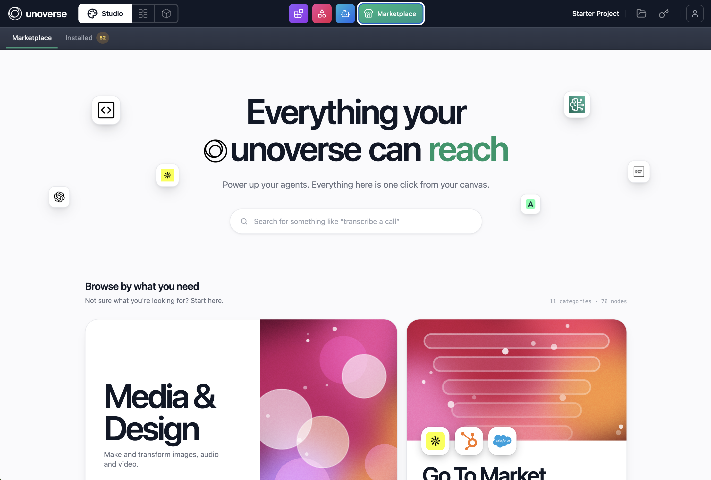
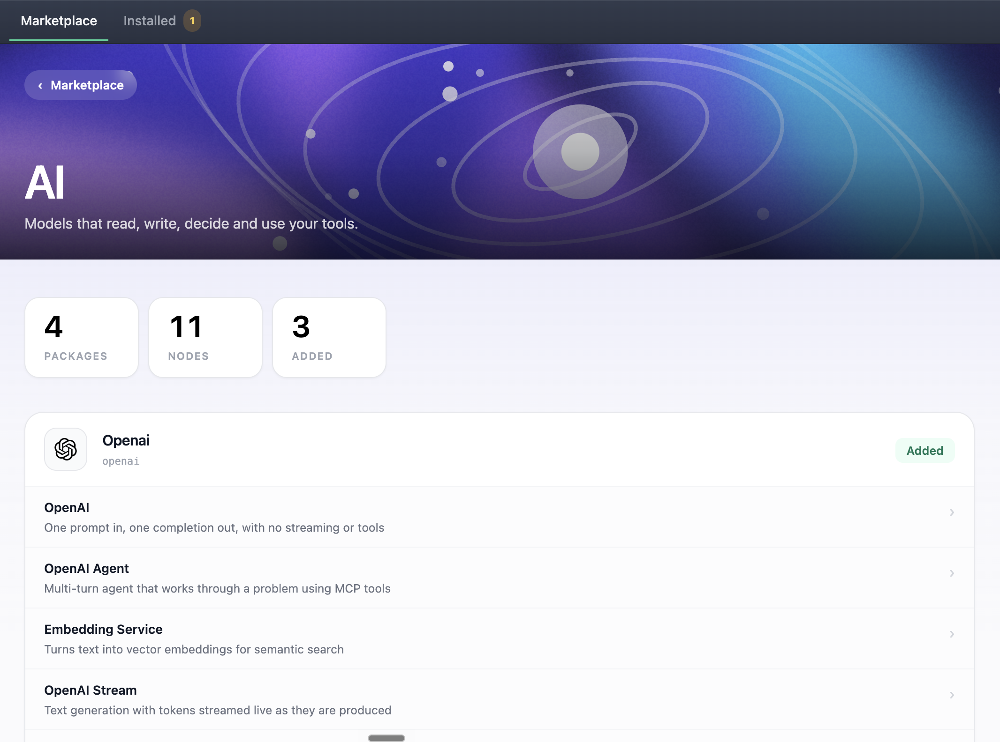
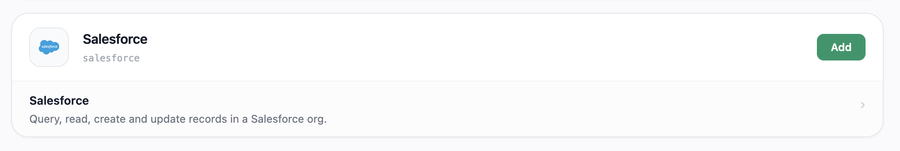

A universe starts empty. The marketplace stocks it: nodes for OpenAI, Airtable, Slack and
AWS, the design system your components render from, and skills your Agents can use.

Everything you install writes a row into your own universe's database. Take what you need,
one package at a time.

## Before you begin

Your universe is running, and you can reach it in a browser.

```bash
unoverse start
```

<Steps>
<Step title="Open the Marketplace">

Open your universe, choose **studio** in the header, then the **marketplace** tile.



**Installed** sits beside it, counting what this universe already holds.

Browse by category, or search. Search is semantic rather than substring, so describe the job:
"transcribe a call" finds the nodes that do it, whatever they are named.

</Step>
<Step title="Add a package">

Open a category. It lists every package in it, expanded to show the nodes each one holds.
Three counts sit above the list: packages, nodes, and how many you have already added.



A package is a set of nodes that belong together, such as everything that talks to OpenAI.
Click **Add** and it writes a row per node into your universe.



The nodes register straight away and appear in the node library in **canvas**, ready to drag
onto a workflow. Nothing restarts, and the button reads **Added** once they are yours.

Add **OpenAI** now. The next challenge uses <span className="node-chip">OpenAI Stream</span>
to build your first Agent.

</Step>
<Step title="Install the design system">

The design system is chosen rather than assumed. A new universe has no components, atoms or
styles until you take it. Its card sits in the catalogue grid alongside the node categories.
Click **Install**.

Do this before the components challenge. Without it, there is nothing to render.

</Step>
<Step title="Add credentials where required">

Some nodes talk to external services and name the credential they need. Add it in **canvas**
under **Credentials**. The next challenge walks through this for your OpenAI key.

</Step>
<Step title="Stay current">

The **Installed** tab carries a badge counting the items whose published version has moved on
from the one you hold. Open it and click **Update** on any of them, or **Remove** to give one
back. An item reading `on disk` is a local definition of your own, which no row can update.

</Step>
</Steps>

<Note>
Installing writes rows into the database of the universe you are in, so what you install in
one stays there. Production is its own universe with its own database, so install there too.
Nothing rides `unoverse deploy`, which moves platform images only.
</Note>

## Next steps

<Card title="Create your first Agent" icon="bot" href="/onboarding/create-your-first-agent" horizontal>
Wire a trigger, a model, and a response together in **canvas**, and talk to it.
</Card>

<Card title="Create your first node" icon="boxes" href="/onboarding/create-your-first-node" horizontal>
Need something the marketplace does not have? Build it.
</Card>
